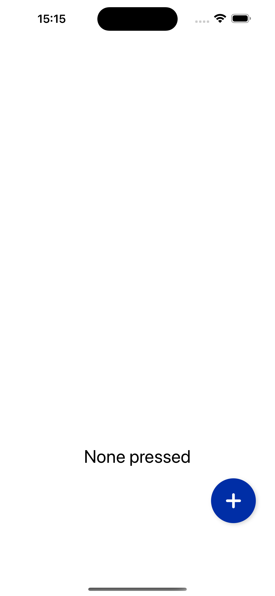
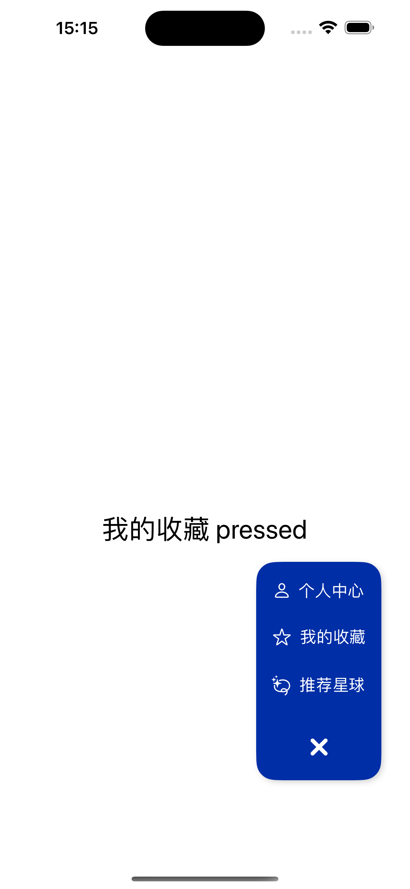

# Floating Menu in SwiftUI

Welcome to our SwiftUI Floating Menu example! This project demonstrates how to create an expandable floating action button menu using SwiftUI. The core of this example is found within two primary files: `ContentView.swift` and `FloatingMenuView.swift`. These files work together to create a dynamic and interactive floating menu that can enhance the user interface of any SwiftUI application.

## Features

- **Expandable Floating Menu**: A primary action button that expands to reveal multiple secondary action buttons.
- **Customizable**: Easily customize the menu items, including icons and labels, to fit your app's needs.
- **Animation**: Smooth expansion and collapse animations for a polished user experience.
- **Action Handling**: Define custom actions for each menu item, providing functionality to each button.

## Implementation Highlights

- **SwiftUI Views**: The floating menu is entirely built using SwiftUI, showcasing the framework's capabilities for creating complex UI components.
- **State Management**: Utilizes `@State` to manage the menu's expanded and collapsed states, demonstrating effective state management in SwiftUI.
- **Modular Design**: The `FloatingMenuView` struct is designed to be reusable, allowing it to be easily integrated into any SwiftUI view.

### Screenshots

Here are some screenshots showcasing the final implementation of the onboarding experience:

  
  

## Getting Started

To explore this example, clone the repository and open the project in Xcode. Navigate to the `ContentView.swift` and `FloatingMenuView.swift` files to examine the implementation details. You can run the project in the Xcode simulator to see the floating menu in action.

## Conclusion

This SwiftUI example serves as a practical demonstration of creating a floating action button menu, a common UI component in many mobile apps. By following this example, you can learn how to implement similar interactive and animated UI elements in your own SwiftUI projects.

We hope this example inspires you to explore more of what SwiftUI has to offer and to incorporate such dynamic UI components into your applications.
